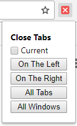

# Close All Tabs
Quickly close all tabs on chrome (with a few more options).

## Install
Download the [latest release](https://github.com/PandawanFr/CloseAllTabs/releases). Open the `.crx` file, and click "Continue." This should install the extension and you should see the icon pop up in the top left corner.

## How it works

### Current
The current checkbox allows you to decide whether or not to close the currently selected tab. If you check it, it will be closed. This option will be remembered and is taken into account by every action.

### On the Left (`Alt+Shift+Left`)
Selecting on the left will close all tabs that are on the left of the current tab.

### On the Right (`Alt+Shift+Right`)
Similarly, the right option will close all tabs that are on the right of the current tab.

### All Tabs (`Alt+Shift+W`)
Selecting All Tabs will close all tabs in the current window.

### All Windows
Selecting All Windows will close all windows. There is no keyboard shortcut for this because Chrome already has this feature (`Ctrl+Shift+Q` for Win and `Cmd+Q` for Mac).

## License
See [License file](LICENSE)
