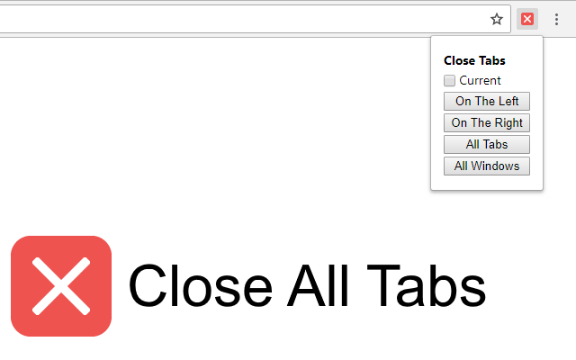

# Close All Tabs

Quickly close all tabs on chrome (with a few more options).  
**EDIT: I found out that Chrome already had that when right clicking a tab *rip***

## Install (source only)

1. Download the [latest release](https://github.com/PandawanFr/CloseAllTabs/releases/latest) and extract the file to your preferred location.
2. In Google Chrome, navigate to `chrome://extensions`, and enable "Developer mode" in the upper right corner.
3. Click on the `Load Unpacked` button and select the src directory that you have downloaded and extracted.

## How it works

### Current

The current checkbox allows you to decide whether or not to close the currently selected tab. If you check it, it will be closed. This option will be remembered and is taken into account by every action.

### On the Left (`Alt+Shift+Left`)

Selecting on the left will close all tabs that are on the left of the current tab.

### On the Right (`Alt+Shift+Right`)

Similarly, the right option will close all tabs that are on the right of the current tab.

### All Tabs (`Alt+Shift+W`)

Selecting All Tabs will close all tabs in the current window.

### All Windows

Selecting All Windows will close all windows. There is no keyboard shortcut for this because Chrome already has this feature (`Ctrl+Shift+Q` for Win and `Cmd+Q` for Mac).

## License

See [License file](LICENSE)
